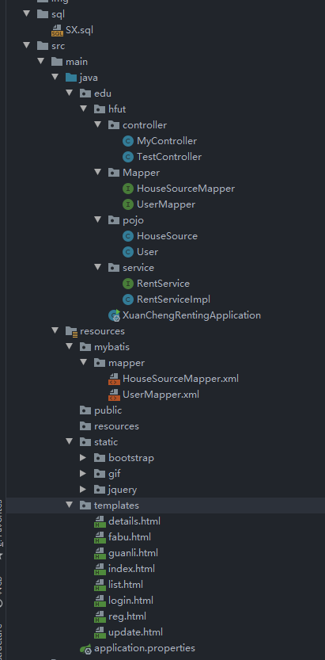

### hfutxc 工程实训

项目结构

该项目由用**SpringBoot + Mybatis"** 搭建网站后端，使用Spring官方提供的模板引擎**Thymeleaf**，用于前后段请求以及参数的传递。数据库使用的是**mysql 8.0.21**

网站UI则使用普通的前端工具

部署时请将resourse目录下**application.properties**文件中连接mysql的端口以及帐号改为自己的即可。

